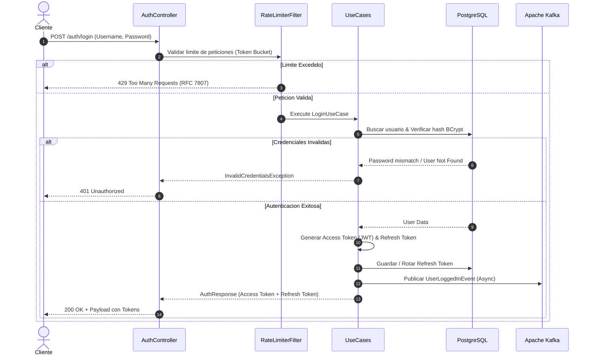
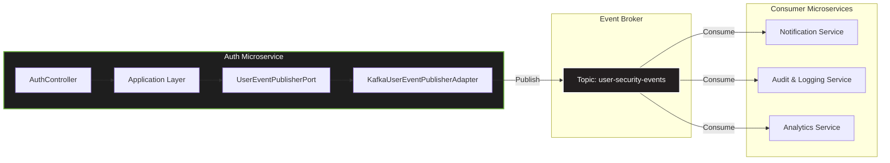

# 🔐 Auth Microservice (`auth-service`)

---

## 🚀 Aspectos Técnicos Destacados (Engineering Highlights)

Este microservicio fue diseñado siguiendo patrones de arquitectura empresarial y altos estándares de resiliencia, rendimiento y seguridad:

*   **Arquitectura Hexagonal (Ports & Adapters):** Desacoplamiento total entre la lógica pura de negocio (`domain`), los casos de uso (`application`) y los frameworks o persistencia (`infrastructure`).
*   **Java 21 Virtual Threads (Project Loom):** Manejo eficiente de concurrencia masiva e I/O bloqueante con consumo mínimo de recursos de hardware.
*   **Gestión Segura de Sesiones (JWT + Refresh Token Rotation):** Emisión de tokens de acceso de corta duración junto con tokens de refresco persistidos y rotados automáticamente para mitigar ataques de tipo *replay attack*.
*   **Rate Limiting por IP y Usuario:** Algoritmo *Token Bucket* implementado en la capa HTTP para prevenir ataques de fuerza bruta y denegación de servicio (DDoS).
*   **Control de Versiones de BD con Liquibase:** Evolución del esquema de base de datos automatizada, consistente e incremental mediante changelogs YAML/SQL.
*   **Arquitectura Orientada a Eventos (Kafka):** Publicación asíncrona de eventos de dominio (`UserRegisteredEvent`, `SecurityAlertEvent`) para auditoría y sincronización entre microservicios.
*   **Cifrado de Credenciales:** Encriptación robusta con `BCrypt` y sal dinámica para el almacenamiento seguro de contraseñas.
*   **Manejo Estandarizado de Excepciones (RFC 7807):** Respuestas de error estructuradas bajo el estándar *Problem Details for HTTP APIs*.

## 📐 Diagramas de Arquitectura y Flujos

### 1. Flujo de Autenticación y Emisión de Tokens (JWT + Refresh Token)

---

### 2. Flujo de Integración de Eventos (Event-Driven con Kafka)

